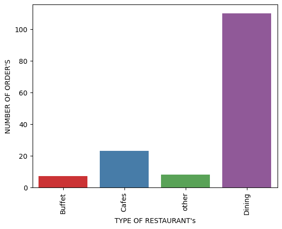
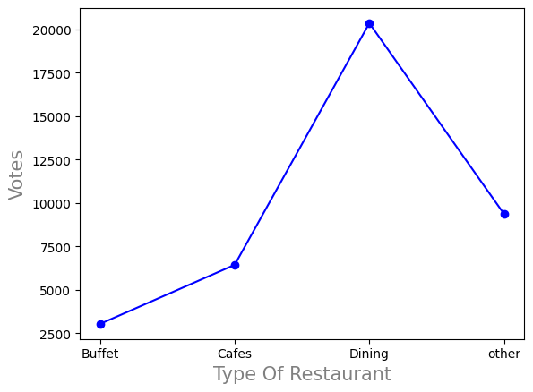
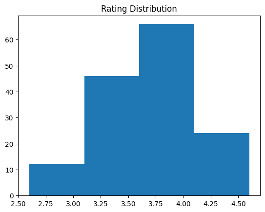
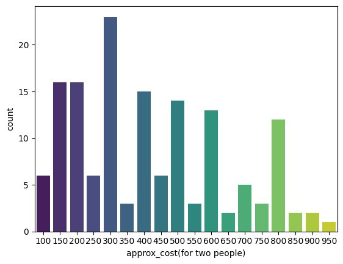
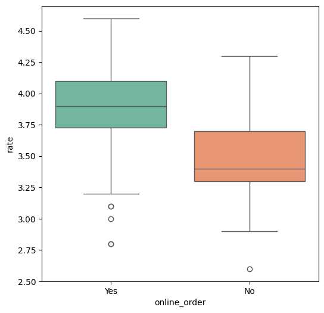
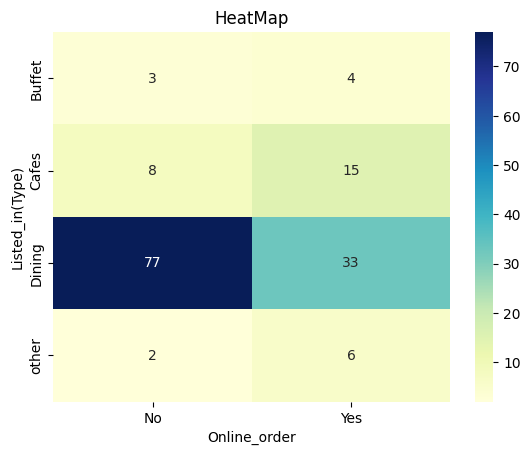

# Python


---

## **Project: Zomato Data Analysis **  

---

## 1 - importing  all the libraries


```python

```


```python
## import all liberies..
## pandas for data manipulation of data and analyis
## numpy for numerical operations 
## matplotlib.pyplot and seaborn for data visualization

import pandas as pd
import numpy as np
import matplotlib.pyplot as plt
import seaborn as sns

```

---

## 2 - create a data frame 


```python
dataframe = pd.read_csv("Zomato data .csv")
print(dataframe)
```

                          name online_order book_table   rate  votes  \
    0                    Jalsa          Yes        Yes  4.1/5    775   
    1           Spice Elephant          Yes         No  4.1/5    787   
    2          San Churro Cafe          Yes         No  3.8/5    918   
    3    Addhuri Udupi Bhojana           No         No  3.7/5     88   
    4            Grand Village           No         No  3.8/5    166   
    ..                     ...          ...        ...    ...    ...   
    143       Melting Melodies           No         No  3.3/5      0   
    144        New Indraprasta           No         No  3.3/5      0   
    145           Anna Kuteera          Yes         No  4.0/5    771   
    146                 Darbar           No         No  3.0/5     98   
    147          Vijayalakshmi          Yes         No  3.9/5     47   
    
         approx_cost(for two people) listed_in(type)  
    0                            800          Buffet  
    1                            800          Buffet  
    2                            800          Buffet  
    3                            300          Buffet  
    4                            600          Buffet  
    ..                           ...             ...  
    143                          100          Dining  
    144                          150          Dining  
    145                          450          Dining  
    146                          800          Dining  
    147                          200          Dining  
    
    [148 rows x 7 columns]
    


```python
dataframe
```


<div>
<style scoped>
    .dataframe tbody tr th:only-of-type {
        vertical-align: middle;
    }

    .dataframe tbody tr th {
        vertical-align: top;
    }

    .dataframe thead th {
        text-align: right;
    }
</style>
<table border="1" class="dataframe">
  <thead>
    <tr style="text-align: right;">
      <th></th>
      <th>name</th>
      <th>online_order</th>
      <th>book_table</th>
      <th>rate</th>
      <th>votes</th>
      <th>approx_cost(for two people)</th>
      <th>listed_in(type)</th>
    </tr>
  </thead>
  <tbody>
    <tr>
      <th>0</th>
      <td>Jalsa</td>
      <td>Yes</td>
      <td>Yes</td>
      <td>4.1/5</td>
      <td>775</td>
      <td>800</td>
      <td>Buffet</td>
    </tr>
    <tr>
      <th>1</th>
      <td>Spice Elephant</td>
      <td>Yes</td>
      <td>No</td>
      <td>4.1/5</td>
      <td>787</td>
      <td>800</td>
      <td>Buffet</td>
    </tr>
    <tr>
      <th>2</th>
      <td>San Churro Cafe</td>
      <td>Yes</td>
      <td>No</td>
      <td>3.8/5</td>
      <td>918</td>
      <td>800</td>
      <td>Buffet</td>
    </tr>
    <tr>
      <th>3</th>
      <td>Addhuri Udupi Bhojana</td>
      <td>No</td>
      <td>No</td>
      <td>3.7/5</td>
      <td>88</td>
      <td>300</td>
      <td>Buffet</td>
    </tr>
    <tr>
      <th>4</th>
      <td>Grand Village</td>
      <td>No</td>
      <td>No</td>
      <td>3.8/5</td>
      <td>166</td>
      <td>600</td>
      <td>Buffet</td>
    </tr>
    <tr>
      <th>...</th>
      <td>...</td>
      <td>...</td>
      <td>...</td>
      <td>...</td>
      <td>...</td>
      <td>...</td>
      <td>...</td>
    </tr>
    <tr>
      <th>143</th>
      <td>Melting Melodies</td>
      <td>No</td>
      <td>No</td>
      <td>3.3/5</td>
      <td>0</td>
      <td>100</td>
      <td>Dining</td>
    </tr>
    <tr>
      <th>144</th>
      <td>New Indraprasta</td>
      <td>No</td>
      <td>No</td>
      <td>3.3/5</td>
      <td>0</td>
      <td>150</td>
      <td>Dining</td>
    </tr>
    <tr>
      <th>145</th>
      <td>Anna Kuteera</td>
      <td>Yes</td>
      <td>No</td>
      <td>4.0/5</td>
      <td>771</td>
      <td>450</td>
      <td>Dining</td>
    </tr>
    <tr>
      <th>146</th>
      <td>Darbar</td>
      <td>No</td>
      <td>No</td>
      <td>3.0/5</td>
      <td>98</td>
      <td>800</td>
      <td>Dining</td>
    </tr>
    <tr>
      <th>147</th>
      <td>Vijayalakshmi</td>
      <td>Yes</td>
      <td>No</td>
      <td>3.9/5</td>
      <td>47</td>
      <td>200</td>
      <td>Dining</td>
    </tr>
  </tbody>
</table>
<p>148 rows × 7 columns</p>
</div>

---

## 3 - convert the data type of column - rate


```python
def handlerate(value):
    value =str(value).split("/")
    value = value[0];
    return float(value)

dataframe["rate"]=dataframe["rate"].apply(handlerate)
print(dataframe.head())
```

                        name online_order book_table  rate  votes  \
    0                  Jalsa          Yes        Yes   4.1    775   
    1         Spice Elephant          Yes         No   4.1    787   
    2        San Churro Cafe          Yes         No   3.8    918   
    3  Addhuri Udupi Bhojana           No         No   3.7     88   
    4          Grand Village           No         No   3.8    166   
    
       approx_cost(for two people) listed_in(type)  
    0                          800          Buffet  
    1                          800          Buffet  
    2                          800          Buffet  
    3                          300          Buffet  
    4                          600          Buffet  
    

---

## 4 - for checking any missing or null value


```python
dataframe.info()
```

    <class 'pandas.core.frame.DataFrame'>
    RangeIndex: 148 entries, 0 to 147
    Data columns (total 7 columns):
     #   Column                       Non-Null Count  Dtype  
    ---  ------                       --------------  -----  
     0   name                         148 non-null    object 
     1   online_order                 148 non-null    object 
     2   book_table                   148 non-null    object 
     3   rate                         148 non-null    float64
     4   votes                        148 non-null    int64  
     5   approx_cost(for two people)  148 non-null    int64  
     6   listed_in(type)              148 non-null    object 
    dtypes: float64(1), int64(2), object(4)
    memory usage: 8.2+ KB


---

## **QUESTION 1**:
## Which type of restaurant do the majority of customers prefer to order food from? 


```python
dataframe.head()
```


<div>
<style scoped>
    .dataframe tbody tr th:only-of-type {
        vertical-align: middle;
    }

    .dataframe tbody tr th {
        vertical-align: top;
    }

    .dataframe thead th {
        text-align: right;
    }
</style>
<table border="1" class="dataframe">
  <thead>
    <tr style="text-align: right;">
      <th></th>
      <th>name</th>
      <th>online_order</th>
      <th>book_table</th>
      <th>rate</th>
      <th>votes</th>
      <th>approx_cost(for two people)</th>
      <th>listed_in(type)</th>
    </tr>
  </thead>
  <tbody>
    <tr>
      <th>0</th>
      <td>Jalsa</td>
      <td>Yes</td>
      <td>Yes</td>
      <td>4.1</td>
      <td>775</td>
      <td>800</td>
      <td>Buffet</td>
    </tr>
    <tr>
      <th>1</th>
      <td>Spice Elephant</td>
      <td>Yes</td>
      <td>No</td>
      <td>4.1</td>
      <td>787</td>
      <td>800</td>
      <td>Buffet</td>
    </tr>
    <tr>
      <th>2</th>
      <td>San Churro Cafe</td>
      <td>Yes</td>
      <td>No</td>
      <td>3.8</td>
      <td>918</td>
      <td>800</td>
      <td>Buffet</td>
    </tr>
    <tr>
      <th>3</th>
      <td>Addhuri Udupi Bhojana</td>
      <td>No</td>
      <td>No</td>
      <td>3.7</td>
      <td>88</td>
      <td>300</td>
      <td>Buffet</td>
    </tr>
    <tr>
      <th>4</th>
      <td>Grand Village</td>
      <td>No</td>
      <td>No</td>
      <td>3.8</td>
      <td>166</td>
      <td>600</td>
      <td>Buffet</td>
    </tr>
  </tbody>
</table>
</div>


## Using a count plot to exact accurate counting of data.


```python
sns.countplot(x=dataframe["listed_in(type)"],palette="Set1") #Set2,coolwarm
plt.xlabel("TYPE OF RESTAURANT's",fontsize=10)
plt.ylabel("NUMBER OF ORDER'S",fontsize=10)
plt.xticks(rotation=90)

```

    C:\Users\arjit\AppData\Local\Temp\ipykernel_17072\2928614793.py:1: FutureWarning: 
    
    Passing `palette` without assigning `hue` is deprecated and will be removed in v0.14.0. Assign the `x` variable to `hue` and set `legend=False` for the same effect.
    
      sns.countplot(x=dataframe["listed_in(type)"],palette="Set1") #Set2,coolwarm
    


    ([0, 1, 2, 3],
     [Text(0, 0, 'Buffet'),
      Text(1, 0, 'Cafes'),
      Text(2, 0, 'other'),
      Text(3, 0, 'Dining')])


    

    


```python
# bargraph
```

## **Conclusion:**  
- The majority of customers tend to order food from **Dining** type restaurants, followed by **Cafes**. **Buffet** restaurants come in third, while other types of restaurants account for a smaller share of customer preferences.
-  This suggests a strong preference for dining-in experiences, with cafes also being a popular choice for many customers.

---


## **Question 2**:
## How many votes does each restaurant type receive from its customers?


```python
dataframe.head()
```


<div>
<style scoped>
    .dataframe tbody tr th:only-of-type {
        vertical-align: middle;
    }

    .dataframe tbody tr th {
        vertical-align: top;
    }

    .dataframe thead th {
        text-align: right;
    }
</style>
<table border="1" class="dataframe">
  <thead>
    <tr style="text-align: right;">
      <th></th>
      <th>name</th>
      <th>online_order</th>
      <th>book_table</th>
      <th>rate</th>
      <th>votes</th>
      <th>approx_cost(for two people)</th>
      <th>listed_in(type)</th>
    </tr>
  </thead>
  <tbody>
    <tr>
      <th>0</th>
      <td>Jalsa</td>
      <td>Yes</td>
      <td>Yes</td>
      <td>4.1</td>
      <td>775</td>
      <td>800</td>
      <td>Buffet</td>
    </tr>
    <tr>
      <th>1</th>
      <td>Spice Elephant</td>
      <td>Yes</td>
      <td>No</td>
      <td>4.1</td>
      <td>787</td>
      <td>800</td>
      <td>Buffet</td>
    </tr>
    <tr>
      <th>2</th>
      <td>San Churro Cafe</td>
      <td>Yes</td>
      <td>No</td>
      <td>3.8</td>
      <td>918</td>
      <td>800</td>
      <td>Buffet</td>
    </tr>
    <tr>
      <th>3</th>
      <td>Addhuri Udupi Bhojana</td>
      <td>No</td>
      <td>No</td>
      <td>3.7</td>
      <td>88</td>
      <td>300</td>
      <td>Buffet</td>
    </tr>
    <tr>
      <th>4</th>
      <td>Grand Village</td>
      <td>No</td>
      <td>No</td>
      <td>3.8</td>
      <td>166</td>
      <td>600</td>
      <td>Buffet</td>
    </tr>
  </tbody>
</table>
</div>


```python
grouped_data=dataframe.groupby("listed_in(type)")["votes"].sum()
result = pd.DataFrame({"votes": grouped_data})
plt.plot(result,c="blue",marker="o")
plt.xlabel("Type Of Restaurant",c="grey",size=15)
plt.ylabel("Votes",c="grey",size=15)
plt.show()
```


    

    


```python
# line graph 
```

## **Conclusion:**  
Dining-type restaurants receive the highest number of votes from customers, indicating a strong preference for this restaurant category.


---


## **Question 3**:
## What is the highest rating received by restaurants across different categories?


```python
dataframe.head()
```


<div>
<style scoped>
    .dataframe tbody tr th:only-of-type {
        vertical-align: middle;
    }

    .dataframe tbody tr th {
        vertical-align: top;
    }

    .dataframe thead th {
        text-align: right;
    }
</style>
<table border="1" class="dataframe">
  <thead>
    <tr style="text-align: right;">
      <th></th>
      <th>name</th>
      <th>online_order</th>
      <th>book_table</th>
      <th>rate</th>
      <th>votes</th>
      <th>approx_cost(for two people)</th>
      <th>listed_in(type)</th>
    </tr>
  </thead>
  <tbody>
    <tr>
      <th>0</th>
      <td>Jalsa</td>
      <td>Yes</td>
      <td>Yes</td>
      <td>4.1</td>
      <td>775</td>
      <td>800</td>
      <td>Buffet</td>
    </tr>
    <tr>
      <th>1</th>
      <td>Spice Elephant</td>
      <td>Yes</td>
      <td>No</td>
      <td>4.1</td>
      <td>787</td>
      <td>800</td>
      <td>Buffet</td>
    </tr>
    <tr>
      <th>2</th>
      <td>San Churro Cafe</td>
      <td>Yes</td>
      <td>No</td>
      <td>3.8</td>
      <td>918</td>
      <td>800</td>
      <td>Buffet</td>
    </tr>
    <tr>
      <th>3</th>
      <td>Addhuri Udupi Bhojana</td>
      <td>No</td>
      <td>No</td>
      <td>3.7</td>
      <td>88</td>
      <td>300</td>
      <td>Buffet</td>
    </tr>
    <tr>
      <th>4</th>
      <td>Grand Village</td>
      <td>No</td>
      <td>No</td>
      <td>3.8</td>
      <td>166</td>
      <td>600</td>
      <td>Buffet</td>
    </tr>
  </tbody>
</table>
</div>


```python
plt.hist(dataframe["rate"],bins=4)
plt.title("Rating Distribution")
plt.show()

```


    

    


```python
# HISTOGRAM
```

## **Conclusion**:
## The highest ratings for restaurants typically fall within the range of 3.25 to 4.


---


## **Question 4:** 
## What is the average spending per order by couples at restaurants?


```python
dataframe.head()
```


<div>
<style scoped>
    .dataframe tbody tr th:only-of-type {
        vertical-align: middle;
    }

    .dataframe tbody tr th {
        vertical-align: top;
    }

    .dataframe thead th {
        text-align: right;
    }
</style>
<table border="1" class="dataframe">
  <thead>
    <tr style="text-align: right;">
      <th></th>
      <th>name</th>
      <th>online_order</th>
      <th>book_table</th>
      <th>rate</th>
      <th>votes</th>
      <th>approx_cost(for two people)</th>
      <th>listed_in(type)</th>
    </tr>
  </thead>
  <tbody>
    <tr>
      <th>0</th>
      <td>Jalsa</td>
      <td>Yes</td>
      <td>Yes</td>
      <td>4.1</td>
      <td>775</td>
      <td>800</td>
      <td>Buffet</td>
    </tr>
    <tr>
      <th>1</th>
      <td>Spice Elephant</td>
      <td>Yes</td>
      <td>No</td>
      <td>4.1</td>
      <td>787</td>
      <td>800</td>
      <td>Buffet</td>
    </tr>
    <tr>
      <th>2</th>
      <td>San Churro Cafe</td>
      <td>Yes</td>
      <td>No</td>
      <td>3.8</td>
      <td>918</td>
      <td>800</td>
      <td>Buffet</td>
    </tr>
    <tr>
      <th>3</th>
      <td>Addhuri Udupi Bhojana</td>
      <td>No</td>
      <td>No</td>
      <td>3.7</td>
      <td>88</td>
      <td>300</td>
      <td>Buffet</td>
    </tr>
    <tr>
      <th>4</th>
      <td>Grand Village</td>
      <td>No</td>
      <td>No</td>
      <td>3.8</td>
      <td>166</td>
      <td>600</td>
      <td>Buffet</td>
    </tr>
  </tbody>
</table>
</div>


```python

```


```python
couple_data = dataframe["approx_cost(for two people)"]
sns.countplot(x=couple_data,palette="viridis")
```

    C:\Users\arjit\AppData\Local\Temp\ipykernel_17072\3262229793.py:2: FutureWarning: 
    
    Passing `palette` without assigning `hue` is deprecated and will be removed in v0.14.0. Assign the `x` variable to `hue` and set `legend=False` for the same effect.
    
      sns.countplot(x=couple_data,palette="viridis")
    


    <Axes: xlabel='approx_cost(for two people)', ylabel='count'>


    

    


```python
# BARGRAPH
```

## **Conclusion**:
## The average spending per order by couples at a restaurant is ₹300. 


---


## **Question 5**:
## Which mode (online or offline) receives higher ratings in terms of user satisfaction?


```python
dataframe.head()
```


<div>
<style scoped>
    .dataframe tbody tr th:only-of-type {
        vertical-align: middle;
    }

    .dataframe tbody tr th {
        vertical-align: top;
    }

    .dataframe thead th {
        text-align: right;
    }
</style>
<table border="1" class="dataframe">
  <thead>
    <tr style="text-align: right;">
      <th></th>
      <th>name</th>
      <th>online_order</th>
      <th>book_table</th>
      <th>rate</th>
      <th>votes</th>
      <th>approx_cost(for two people)</th>
      <th>listed_in(type)</th>
    </tr>
  </thead>
  <tbody>
    <tr>
      <th>0</th>
      <td>Jalsa</td>
      <td>Yes</td>
      <td>Yes</td>
      <td>4.1</td>
      <td>775</td>
      <td>800</td>
      <td>Buffet</td>
    </tr>
    <tr>
      <th>1</th>
      <td>Spice Elephant</td>
      <td>Yes</td>
      <td>No</td>
      <td>4.1</td>
      <td>787</td>
      <td>800</td>
      <td>Buffet</td>
    </tr>
    <tr>
      <th>2</th>
      <td>San Churro Cafe</td>
      <td>Yes</td>
      <td>No</td>
      <td>3.8</td>
      <td>918</td>
      <td>800</td>
      <td>Buffet</td>
    </tr>
    <tr>
      <th>3</th>
      <td>Addhuri Udupi Bhojana</td>
      <td>No</td>
      <td>No</td>
      <td>3.7</td>
      <td>88</td>
      <td>300</td>
      <td>Buffet</td>
    </tr>
    <tr>
      <th>4</th>
      <td>Grand Village</td>
      <td>No</td>
      <td>No</td>
      <td>3.8</td>
      <td>166</td>
      <td>600</td>
      <td>Buffet</td>
    </tr>
  </tbody>
</table>
</div>


```python
plt.figure(figsize = (6,6))
sns.boxplot(x = "online_order",y ="rate",data = dataframe,palette ="Set2")
```

    C:\Users\arjit\AppData\Local\Temp\ipykernel_17072\1069442493.py:2: FutureWarning: 
    
    Passing `palette` without assigning `hue` is deprecated and will be removed in v0.14.0. Assign the `x` variable to `hue` and set `legend=False` for the same effect.
    
      sns.boxplot(x = "online_order",y ="rate",data = dataframe,palette ="Set2")
    


    <Axes: xlabel='online_order', ylabel='rate'>


    

    


```python
# box plot
```


      Cell In[90], line 1
        |
        ^
    SyntaxError: invalid syntax
    


## **Conclusion**:
## In conclusion, online orders receive higher ratings than offline orders. This trend reflects greater customer satisfaction with online ordering.


---


## **Question 6**:
## What type of restaurant generates the highest number of offline orders, making them eligible for Zomato's promotional offers?


```python
dataframe.head()
```


<div>
<style scoped>
    .dataframe tbody tr th:only-of-type {
        vertical-align: middle;
    }

    .dataframe tbody tr th {
        vertical-align: top;
    }

    .dataframe thead th {
        text-align: right;
    }
</style>
<table border="1" class="dataframe">
  <thead>
    <tr style="text-align: right;">
      <th></th>
      <th>name</th>
      <th>online_order</th>
      <th>book_table</th>
      <th>rate</th>
      <th>votes</th>
      <th>approx_cost(for two people)</th>
      <th>listed_in(type)</th>
    </tr>
  </thead>
  <tbody>
    <tr>
      <th>0</th>
      <td>Jalsa</td>
      <td>Yes</td>
      <td>Yes</td>
      <td>4.1</td>
      <td>775</td>
      <td>800</td>
      <td>Buffet</td>
    </tr>
    <tr>
      <th>1</th>
      <td>Spice Elephant</td>
      <td>Yes</td>
      <td>No</td>
      <td>4.1</td>
      <td>787</td>
      <td>800</td>
      <td>Buffet</td>
    </tr>
    <tr>
      <th>2</th>
      <td>San Churro Cafe</td>
      <td>Yes</td>
      <td>No</td>
      <td>3.8</td>
      <td>918</td>
      <td>800</td>
      <td>Buffet</td>
    </tr>
    <tr>
      <th>3</th>
      <td>Addhuri Udupi Bhojana</td>
      <td>No</td>
      <td>No</td>
      <td>3.7</td>
      <td>88</td>
      <td>300</td>
      <td>Buffet</td>
    </tr>
    <tr>
      <th>4</th>
      <td>Grand Village</td>
      <td>No</td>
      <td>No</td>
      <td>3.8</td>
      <td>166</td>
      <td>600</td>
      <td>Buffet</td>
    </tr>
  </tbody>
</table>
</div>


```python
pivot_table = dataframe.pivot_table(index ="listed_in(type)",columns="online_order",aggfunc="size",fill_value=0)
sns.heatmap(pivot_table,annot =True,cmap="YlGnBu",fmt="d")
plt.title("HeatMap")
plt.xlabel("Online_order")
plt.ylabel("Listed_in(Type)")
plt.show()
```


    

    


```python
#HEATMAP
```

## **Conclusion**:
## Dining restaurants receive more offline orders, while cafes receive more online orders. This suggests that customers prefer in-person dining at restaurants and opt for online ordering at cafes.

---

```python

```
---
## Conclusion:

This **Zomato Data Analysis** project provides insightful findings based on the analysis of restaurant data across various categories. The following key conclusions can be drawn from the analysis:

1. **Most Preferred Restaurant Type**:
- The majority of customers tend to prefer **Dining** type restaurants, followed by **Cafes**. **Buffet** restaurants come in third, while other types have a relatively smaller share in customer preferences.
- This suggests that dining-in experiences are more popular, with cafes also being a popular choice.

3. **Votes by Restaurant Type**:
- **Dining** type restaurants receive the highest number of votes, reinforcing the fact that this category has the most customer engagement.
- This further emphasizes the popularity of dining options for customers.

5. **Highest Ratings by Restaurant Category**:
- The highest ratings across various restaurant types were analyzed, offering a glimpse into customer satisfaction levels and the overall quality of services provided by restaurants. 

Through this analysis, we gain a better understanding of customer behavior, which can be used for further research or business decisions in the restaurant industry. The project effectively demonstrates the use of Python libraries like Pandas, NumPy, and Seaborn for data manipulation and visualization, and serves as an excellent showcase of data analysis skills.
---

```python

```
